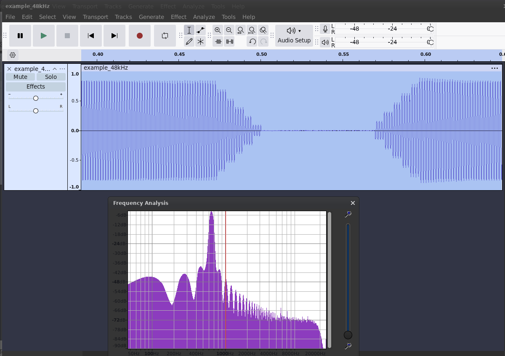
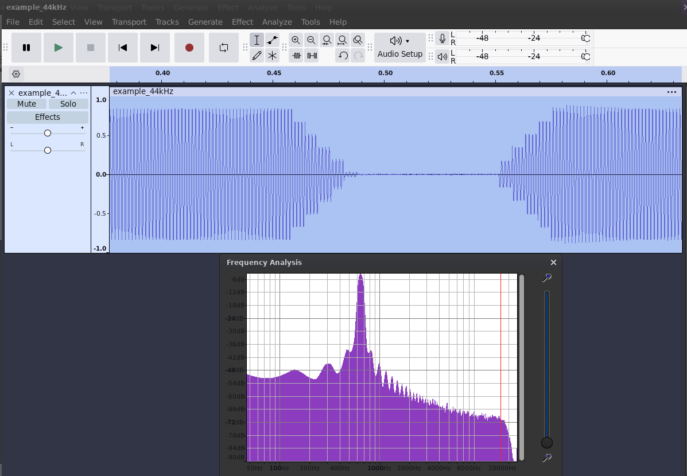
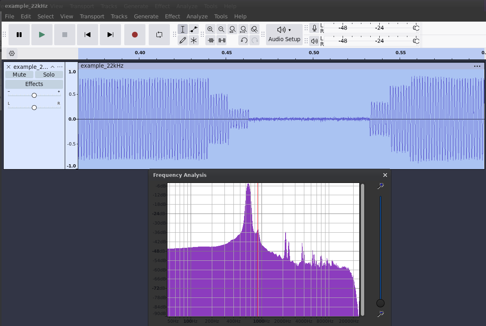
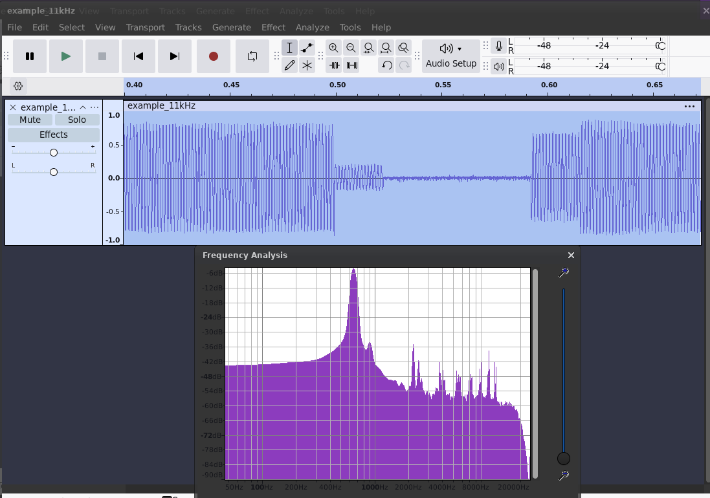

<!-- SPDX-License-Identifier: MIT -->
<!-- SPDX-FileCopyrightText: Copyright 2025 Sam Blenny -->
# Synthio Click Reproducer

Code to reproduce synthio note attack & release clicks and sample rate aliasing
noise

Hardware:
- Adafruit Fruit Jam

Software:
- CircuitPython Absolute Newest (from S3) as of 12/20/2025:
  [adafruit-circuitpython-adafruit_fruit_jam-en_US-20251219-main-PR10759-ba414b3.uf2](https://adafruit-circuit-python.s3.amazonaws.com/bin/adafruit_fruit_jam/en_US/adafruit-circuitpython-adafruit_fruit_jam-en_US-20251219-main-PR10759-ba414b3.uf2)
- CircuitPython Library bundle from 12/19/2025:
  [adafruit-circuitpython-bundle-10.x-mpy-20251219.zip](https://github.com/adafruit/Adafruit_CircuitPython_Bundle/releases/download/20251219/adafruit-circuitpython-bundle-10.x-mpy-20251219.zip)
- Code from this repo (see project bundle zip on release page)

## Example Audio 48000 kHz

[example_48kHz.wav](example_48kHz.wav)

## Example Audio 44100 kHz

[example_44kHz.wav](example_44kHz.wav)

## Example Audio 22050 kHz

[example_22kHz.wav](example_22kHz.wav)

## Example Audio 11025 kHz

[example_11kHz.wav](example_11kHz.wav)
