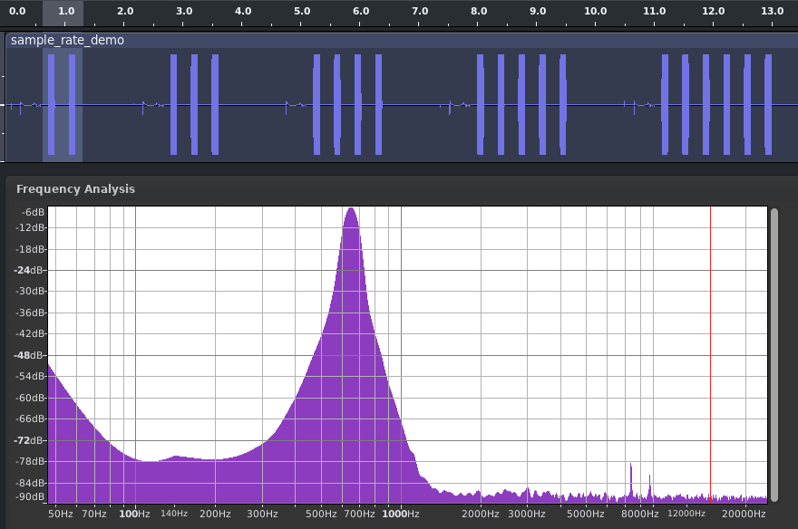
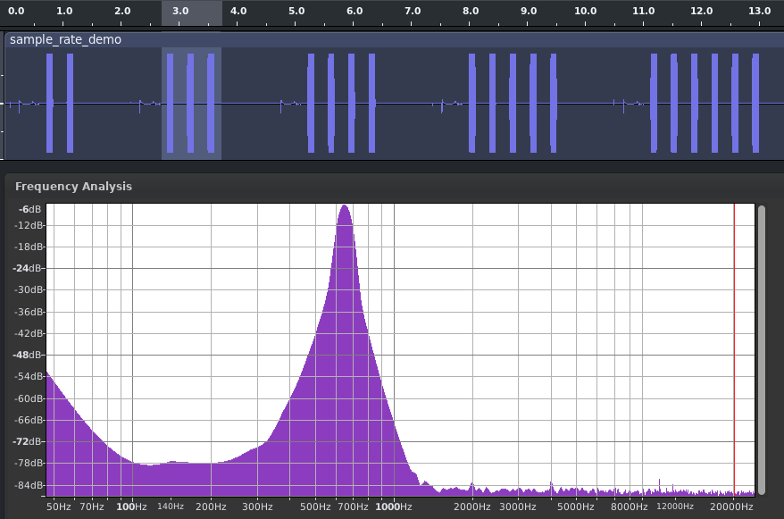
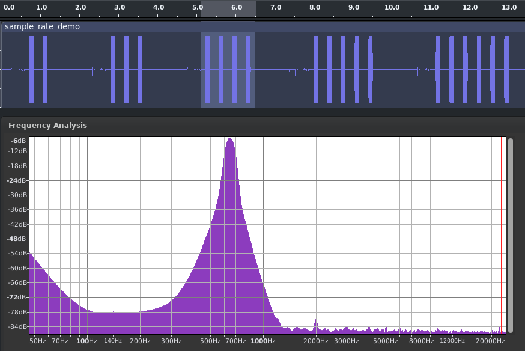
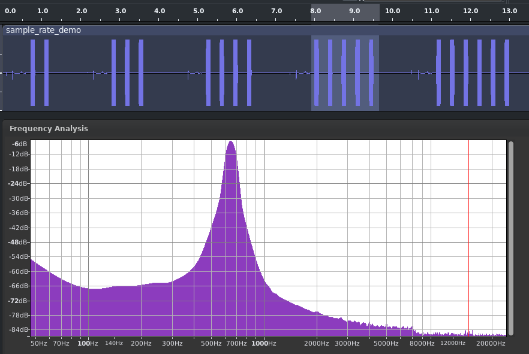
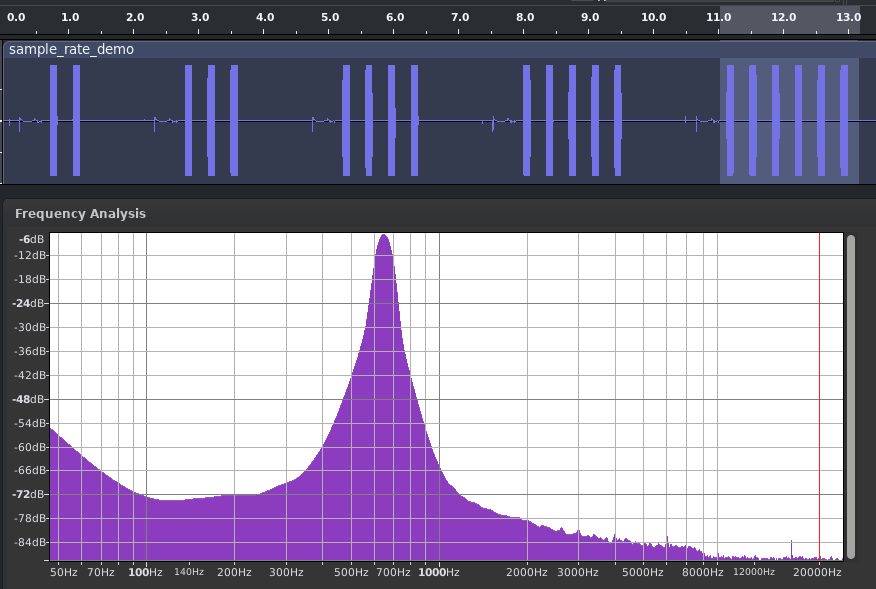

<!-- SPDX-License-Identifier: MIT -->
<!-- SPDX-FileCopyrightText: Copyright 2025 Sam Blenny -->
# Synthio Click Reproducer (15 Mhz Sample Rate Demo)

Audio recording and spectrum plots of sample rate demo. The demo loops through
8000, 11025, 22050, 44100, and 48000 Hz sample rates, playing a series of wav
file beeps at each sample rate. The point is to have a side by side comparison
of the audio quality. 8000 Hz gets 2 beeps, 11025 gets 3, and so on up to 6
beeps for 48000 Hz.

This is a wav file recording of the full sequence:
[sample_rate_demo.wav](sample_rate_demo.wav)

## Spectrum Plot for 8000 Hz (2 beeps)

## Spectrum Plot for 11025 Hz (3 beeps)

## Spectrum Plot for 22050 Hz (4 beeps)

## Spectrum Plot for 44100 Hz (5 beeps)

## Spectrum Plot for 48000 Hz (6 beeps)

