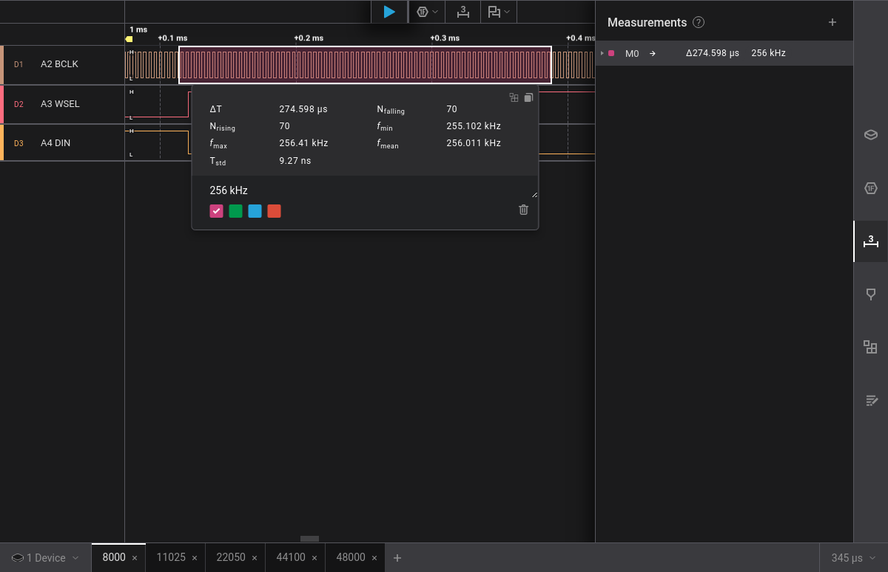
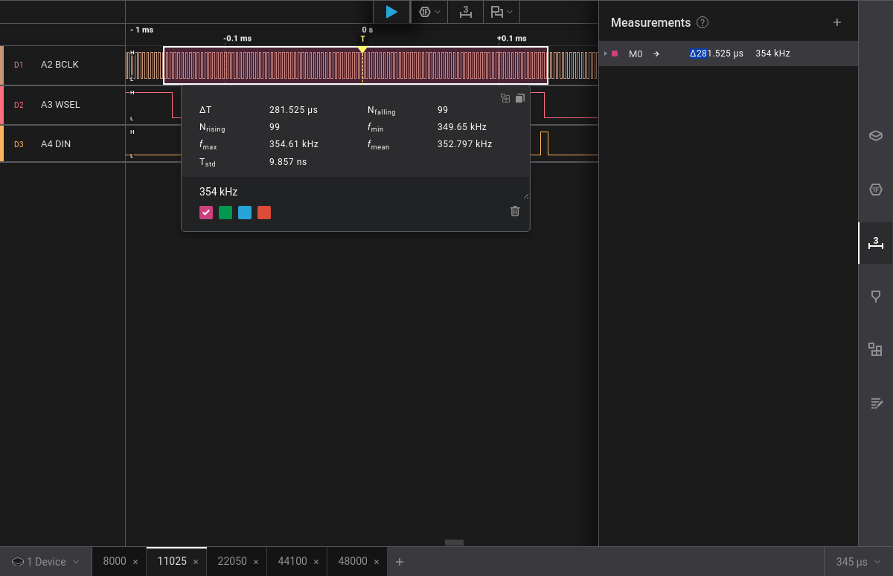
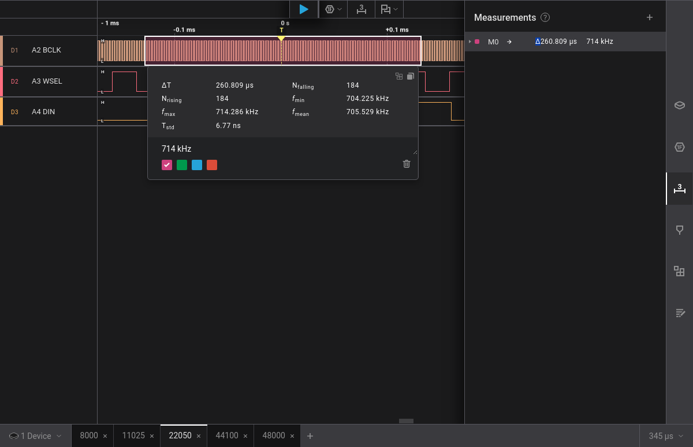
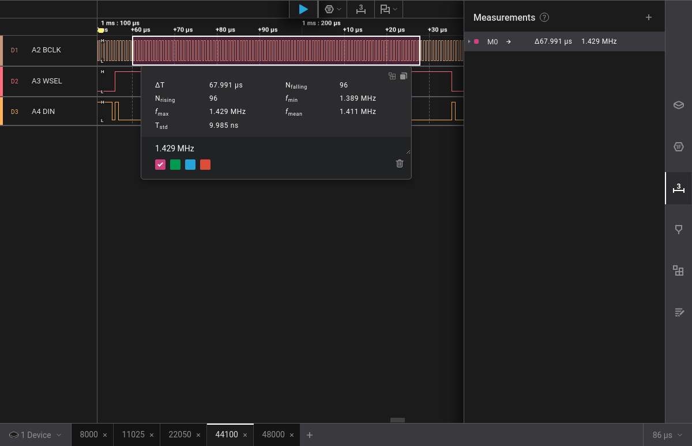
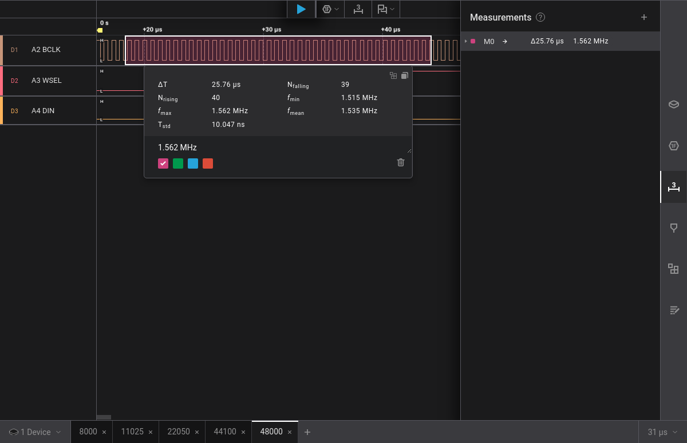

<!-- SPDX-License-Identifier: MIT -->
<!-- SPDX-FileCopyrightText: Copyright 2025 Sam Blenny -->
# Synthio Click Reproducer

Example code demonstrating how to fix the TLV320DAC audio problems at low
sample rates

Hardware:
- Adafruit Fruit Jam

Software:
- CircuitPython Absolute Newest (from S3) as of 12/20/2025:
  [adafruit-circuitpython-adafruit_fruit_jam-en_US-20251219-main-PR10759-ba414b3.uf2](https://adafruit-circuit-python.s3.amazonaws.com/bin/adafruit_fruit_jam/en_US/adafruit-circuitpython-adafruit_fruit_jam-en_US-20251219-main-PR10759-ba414b3.uf2)
- CircuitPython Library bundle from 12/19/2025:
  [adafruit-circuitpython-bundle-10.x-mpy-20251219.zip](https://github.com/adafruit/Adafruit_CircuitPython_Bundle/releases/download/20251219/adafruit-circuitpython-bundle-10.x-mpy-20251219.zip)
- Code from this repo (see project bundle zip on release page)

## Summary of BCLK Frequencies

| Sample Rate | mean BCLK |
| ----------- | --------- |
| 8000  | 256.011 kHz |
| 11025 | 352.797 kHz |
| 22050 | 705.529 kHz |
| 44100 | 1.411 MHz |
| 48000 | 1.535 MHz |

## BCLK for 8000 Hz Sample Rate

## BCLK for 11025 Hz Sample Rate

## BCLK for 22050 Hz Sample Rate

## BCLK for 44100 Hz Sample Rate

## BCLK for 48000 Hz Sample Rate

